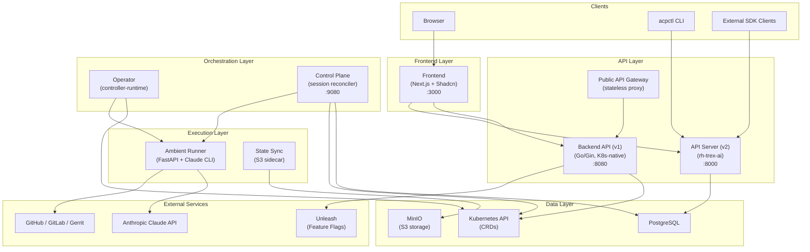
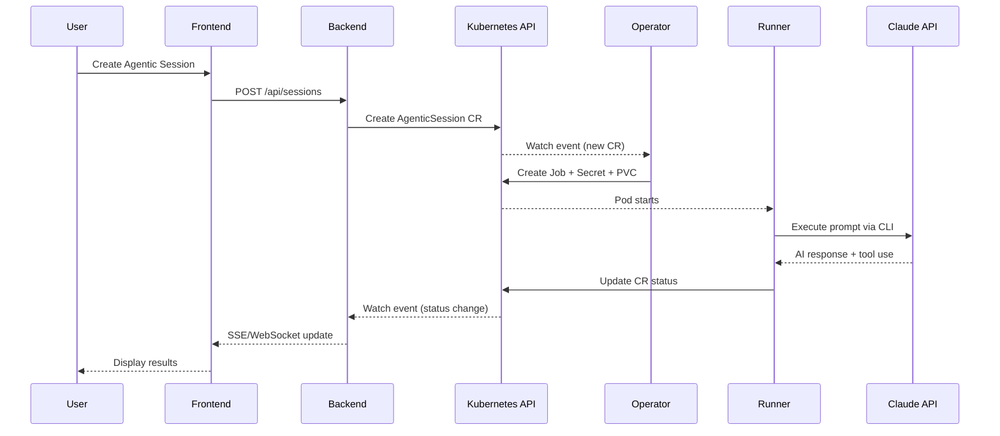

# Architecture

## Overview

The Ambient Code Platform is a Kubernetes-native system that orchestrates AI agentic sessions. It follows a microservices architecture deployed on Kubernetes, with two parallel API stacks: a legacy K8s-native backend and a new REST/PostgreSQL-based API server.

## Architecture Diagram

## Session Lifecycle

## Architecture Transition

The platform is transitioning from a v1 (K8s-native) to v2 (REST/PostgreSQL) architecture:

| Aspect | v1 (Legacy) | v2 (Target) |
|--------|-------------|-------------|
| Data Store | Kubernetes CRDs (etcd) | PostgreSQL |
| API Style | K8s-native via Backend | REST via API Server |
| Auth | User token → K8s RBAC | OIDC (built into rh-trex-ai) |
| Type Safety | Manual model sync | OpenAPI → Generated SDKs |
| Orchestration | Backend + Operator | Control Plane + Operator |

Both stacks run in parallel during migration. Frontend supports dual-mode toggling.

## Design Patterns

- **CRD-Driven**: Core entities (AgenticSession, ProjectSettings) are Kubernetes Custom Resources
- **Operator Pattern**: Controller watches CRDs, reconciles desired vs actual state
- **Sidecar Pattern**: State-sync container handles S3 persistence alongside runner
- **Proxy Pattern**: Frontend proxies API calls through Next.js API routes; Public API proxies to backend
- **Bridge Pattern**: Runner uses pluggable bridges (Claude, Gemini CLI, LangGraph) for AI provider abstraction
- **OpenAPI-First**: v2 stack generates SDKs from a canonical OpenAPI spec
- **Feature Flags**: Unleash gates new features with workspace-scoped overrides
- **AG-UI Protocol**: Runner exposes AG-UI compliant streaming endpoints for real-time event delivery

## Security Architecture

- User tokens required for all API operations (never service account for user-facing ops)
- OwnerReferences on all K8s child resources for automatic garbage collection
- Restricted SecurityContext: `runAsNonRoot`, drop `ALL` capabilities, `readOnlyRootFilesystem`
- No tokens in logs/errors/responses
- Per-session credential isolation
- NetworkPolicy for runner pods
