# Components

## Component Map

```mermaid
graph LR
    subgraph "components/"
        direction TB
        FE["frontend/\nNext.js + Shadcn"]
        BE["backend/\nGo/Gin REST API"]
        OP["operator/\nK8s Controller"]
        RN["runners/ambient-runner/\nPython + FastAPI"]
        SS["runners/state-sync/\nS3 Sidecar"]
        PA["public-api/\nStateless Gateway"]
        AS["ambient-api-server/\nrh-trex-ai REST"]
        CP["ambient-control-plane/\nSession Reconciler"]
        CL["ambient-cli/\nacpctl CLI"]
        SDK["ambient-sdk/\nGo + Python + TS"]
        MCP["ambient-mcp/\nMCP Server"]
        MF["manifests/\nKustomize Deploys"]
    end
```

## Frontend (`components/frontend/`)

- **Technology**: Next.js 15 + Shadcn UI + React Query
- **Purpose**: Web interface for managing agentic sessions, projects, and integrations
- **Key directories**:
  - `src/app/` — Next.js App Router pages and API routes
  - `src/components/` — React components (chat, session, onboarding, workspace-sections)
  - `src/services/` — API layer, adapters (v1/v2), queries (React Query hooks)
  - `src/types/` — TypeScript type definitions
  - `src/hooks/` — Custom hooks including AG-UI integration
- **Conventions**: No `any` types; Shadcn-only UI; React Query for all data ops; colocate single-use components
- **Entry points**: `src/app/page.tsx`, `src/app/projects/[name]/page.tsx`

## Backend API (`components/backend/`)

- **Technology**: Go + Gin framework
- **Module**: `ambient-code-backend`
- **Purpose**: REST API managing K8s Custom Resources with multi-tenant project isolation
- **Key files**:
  - `main.go` — Entry point
  - `routes.go` — Route registration
  - `handlers/sessions.go` — Session CRUD lifecycle
  - `handlers/middleware.go` — Auth & RBAC middleware
  - `handlers/projects.go` — Project management
  - `types/` — Data models (session, project, provider types)
  - `websocket/` — AG-UI WebSocket proxy and store
- **Integrations**: GitHub, GitLab, Gerrit, Jira, LDAP, CodeRabbit, Unleash
- **Critical rule**: All user-facing ops use `GetK8sClientsForRequest(c)`, never the service account

## Operator (`components/operator/`)

- **Technology**: Go + controller-runtime
- **Module**: `ambient-code-operator`
- **Purpose**: Kubernetes controller that watches AgenticSession CRDs and creates Jobs
- **Key files**:
  - `main.go` — Entry point, controller setup
  - `internal/handlers/sessions.go` — Session reconciliation logic
  - `internal/config/config.go` — K8s client initialization
- **Patterns**: Reconciliation loop, OwnerReferences on child resources, restricted SecurityContext

## Runner (`components/runners/ambient-runner/`)

- **Technology**: Python + FastAPI + Claude Code CLI (claude-agent-sdk)
- **Purpose**: Executes AI tasks in Kubernetes Job pods
- **Key files**:
  - `main.py` — Entry point
  - `ambient_runner/app.py` — FastAPI application
  - `ambient_runner/bridge.py` — Bridge registry and base
  - `ambient_runner/bridges/claude/` — Claude Code bridge
  - `ambient_runner/bridges/gemini_cli/` — Gemini CLI bridge
  - `ambient_runner/bridges/langgraph/` — LangGraph bridge
  - `ambient_runner/endpoints/` — HTTP endpoints (run, events, health, capabilities)
  - `ambient_runner/middleware/` — Secret redaction, tracing, gRPC push
  - `ag_ui_claude_sdk/` — AG-UI protocol adapter for Claude
- **Bridges**: Pluggable AI provider backends (Claude, Gemini CLI, LangGraph)

## State Sync (`components/runners/state-sync/`)

- **Purpose**: S3 sidecar container for persisting session workspace state to MinIO

## API Server (`components/ambient-api-server/`)

- **Technology**: Go + rh-trex-ai framework + PostgreSQL
- **Module**: `github.com/ambient-code/platform/components/ambient-api-server`
- **Purpose**: v2 REST API microservice — replaces backend + public-api
- **Key directories**:
  - `cmd/` — CLI entry point
  - `pkg/` — Core packages
  - `plugins/` — Kind-based plugin system
  - `openapi/` — OpenAPI spec (source of truth for SDK generation)
  - `templates/` — Server templates
- **Features**: OIDC built-in, PostgreSQL-native, OpenAPI-first, RBAC-extensible

## Control Plane (`components/ambient-control-plane/`)

- **Technology**: Go
- **Module**: `github.com/ambient-code/platform/components/ambient-control-plane`
- **Purpose**: Bridges PostgreSQL and Kubernetes — reconciles API Server state with K8s CRDs
- **Key directories**: `cmd/`, `internal/`

## CLI (`components/ambient-cli/`)

- **Technology**: Go
- **Module**: `github.com/ambient-code/platform/components/ambient-cli`
- **Binary**: `acpctl`
- **Purpose**: Command-line tool for managing agentic sessions
- **Key directories**: `cmd/`, `internal/`, `pkg/`

## SDK (`components/ambient-sdk/`)

- **Purpose**: Multi-language client SDK for the platform's public REST API
- **Sub-packages**:
  - `go-sdk/` — Go client library
  - `python-sdk/` — Python client library
  - `ts-sdk/` — TypeScript client library (`@ambient-platform/sdk`)
  - `generator/` — OpenAPI → SDK code generator
- **Generation**: All SDKs generated from `ambient-api-server/openapi/openapi.yaml`

## MCP Server (`components/ambient-mcp/`)

- **Technology**: Go + mcp-go
- **Purpose**: Model Context Protocol server for tool integration
- **Key files**: `main.go`, `server.go`, `tools/`, `client/`, `tokenexchange/`

## Public API (`components/public-api/`)

- **Technology**: Go
- **Module**: `ambient-code-public-api`
- **Purpose**: Stateless HTTP gateway, proxies to backend with auth headers (no direct K8s access)

## Manifests (`components/manifests/`)

- **Technology**: Kustomize
- **Purpose**: Kubernetes deployment resources
- **Structure**:
  - `base/` — Base resources (CRDs, core deployments, RBAC, platform)
  - `overlays/` — Environment-specific overlays (kind, kind-local, production)
  - `components/` — Reusable kustomize components
  - `observability/` — OTel + Grafana manifests
