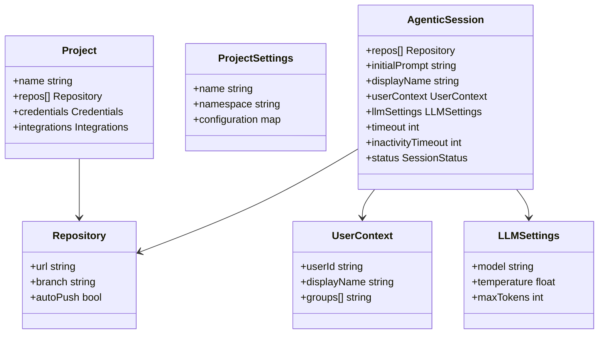
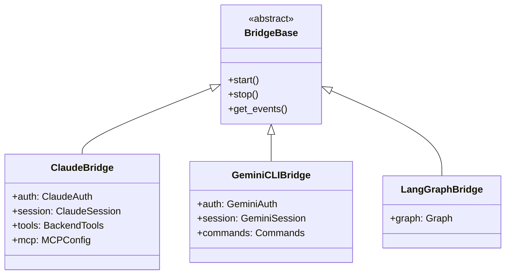

# Data Models

## Core Entities



## Backend Types (`components/backend/types/`)

| File | Types | Description |
|------|-------|-------------|
| `session.go` | Session, SessionSpec, SessionStatus | Agentic session data model |
| `project.go` | Project, ProjectSpec | Project configuration |
| `models.go` | Model, ModelList | LLM model definitions |
| `provider.go` | Provider, ProviderConfig | Git provider abstraction |
| `gitlab.go` | GitLabProject, GitLabGroup | GitLab-specific types |
| `common.go` | Pagination, ListResponse | Shared types |
| `errors.go` | APIError, ErrorResponse | Error types |
| `agui.go` | AG-UI protocol types | Agent UI event types |
| `scheduled_session.go` | ScheduledSession | Scheduled session types |

## Kubernetes CRD Schema

### AgenticSession Spec

```yaml
spec:
  repos:
    - url: string          # Git repository URL
      branch: string       # Branch (default: "main")
      autoPush: boolean    # Auto-push changes
  initialPrompt: string    # Session prompt
  displayName: string      # Human-readable name
  userContext:
    userId: string         # User identifier (from SSO)
    displayName: string    # Display name
    groups: [string]       # Group memberships
  llmSettings:
    model: string          # Default: "claude-sonnet-4-6"
    temperature: number    # Default: 0.7
    maxTokens: integer     # Default: 4000
  timeout: integer         # Seconds (default: 300)
  inactivityTimeout: integer
```

### ProjectSettings Spec

Defined in: `components/manifests/base/crds/projectsettings-crd.yaml`

## v2 Data Model (API Server)

The v2 data model is defined in `components/ambient-api-server/openapi/openapi.yaml` and uses PostgreSQL storage. The rh-trex-ai framework's plugin system generates Go types from kind definitions.

Key resource types planned/implemented:
- Projects
- Agents
- Sessions
- Credentials
- Users (RBAC)

See `components/ambient-api-server/ambient-data-model.md` for the full v2 data model comparison.

## Runner Data Models

### Bridge Configuration



### AG-UI Events

The runner uses the AG-UI protocol for streaming events to the frontend. Event types include:
- Text output events
- Tool use events
- Status change events
- Error events
- Reasoning/thinking events

Defined in: `ag_ui_claude_sdk/types.py`, `ag_ui_claude_sdk/handlers.py`

## Feature Flag Model

Feature flags are managed via Unleash with workspace-scoped overrides:
- Backend integration: `components/backend/featureflags/featureflags.go`
- Admin handlers: `components/backend/handlers/featureflags_admin.go`
- Frontend queries: `src/app/api/feature-flags/`
