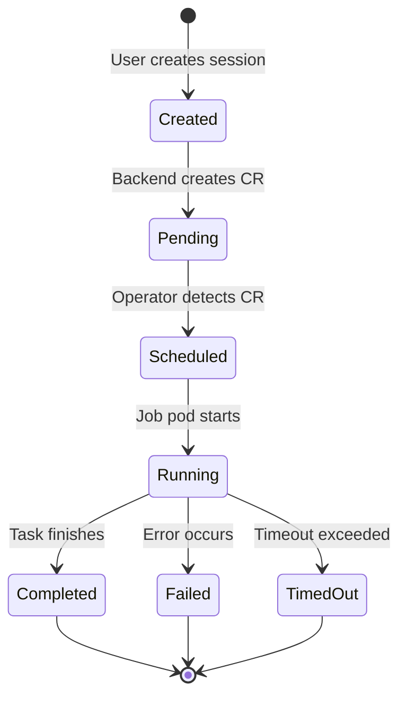
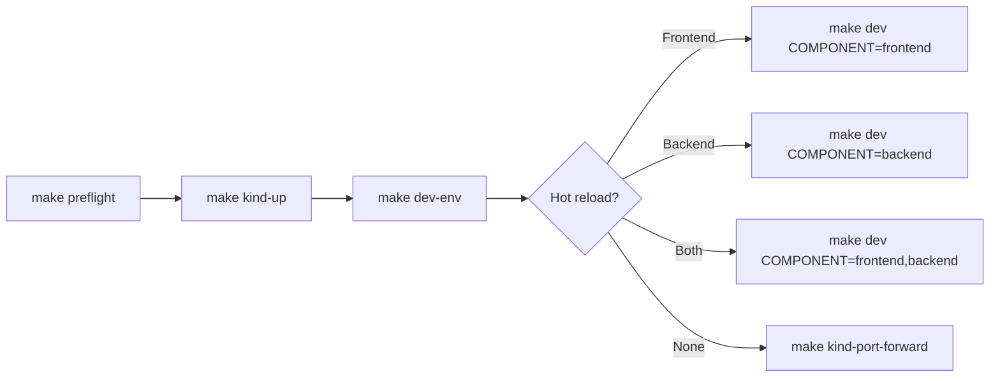
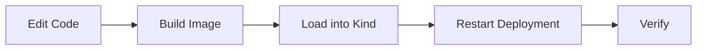
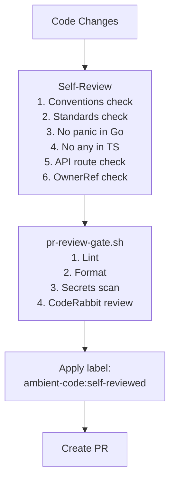
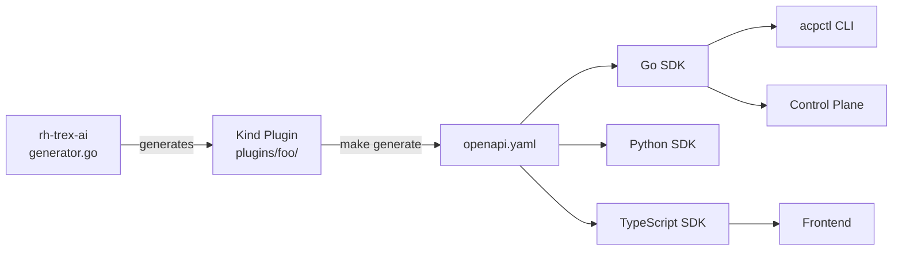

# Workflows

## Session Lifecycle Workflow

## Development Workflow

### Local Development with Kind

1. `make preflight` — Validate prerequisites (kind, kubectl, container engine, Node/Go)
2. `make kind-up` — Create Kind cluster, deploy all components, set up MinIO, extract test token
3. `make dev COMPONENT=frontend` — Port-forward backend, hot-reload frontend locally
4. `make kind-rebuild` — Rebuild all images and redeploy to running cluster

### Component Rebuild Cycle

- `make kind-reload-backend` — Rebuild and reload backend only
- `make kind-reload-frontend` — Rebuild and reload frontend only
- `make kind-reload-operator` — Rebuild and reload operator only

## CI/CD Workflows

```mermaid
flowchart TD
    PR[Pull Request] --> Lint[lint.yml\nPre-commit checks]
    PR --> Unit[unit-tests.yml\nGo + Frontend tests]
    PR --> Build[components-build-deploy.yml\nBuild all images]
    PR --> E2E[e2e.yml\nCypress tests]
    PR --> Docs[docs-lint.yml\nVale + markdownlint]
    PR --> Kustomize[kustomize-check.yml\nManifest validation]
    PR --> SDD[sdd-preflight.yml\nConstitution compliance]
    PR --> Review[pull-reviews.yml\nAutomated review]

    Merge[Merge to main] --> Deploy[prod-release-deploy.yaml\nProduction deployment]
    Merge --> Sync[sync-alpha-from-main.yml\nAlpha branch sync]

    Schedule[Scheduled] --> SDK[sdk-version-bump.yml\nDaily SDK checks]
    Schedule --> Stale[stale.yml\nStale issue cleanup]
    Schedule --> Models[model-discovery.yml\nModel catalog update]
    Schedule --> Drift[ambient-sdk-drift-check.yml\nSDK drift detection]
```

### Key CI Workflows

| Workflow | Trigger | Purpose |
|----------|---------|---------|
| `lint.yml` | PR | Run pre-commit hooks on all files |
| `unit-tests.yml` | PR | Go and frontend unit tests |
| `e2e.yml` | PR | Cypress end-to-end tests with Kind |
| `components-build-deploy.yml` | PR/merge | Build and push container images |
| `prod-release-deploy.yaml` | Merge to main | Production deployment |
| `sdk-version-bump.yml` | Daily schedule | Check for claude-agent-sdk updates |
| `model-discovery.yml` | Schedule | Discover and catalog available models |
| `ambient-sdk-drift-check.yml` | Schedule | Detect SDK/API drift |
| `sdd-preflight.yml` | PR | Constitution compliance checks |
| `pull-reviews.yml` | PR | Automated code review |
| `amber-auto-review.yml` | PR | Amber automation review |
| `feedback-loop.yml` | Various | Developer feedback collection |

## PR Review Gate

## Code Generation Pipeline (v2)

## Agent Workflows (Spec-Driven)

The `workflows/` directory contains agent-consumable procedures:

| Workflow | Purpose |
|----------|---------|
| `sessions/ambient-model.workflow.md` | Data model change implementation pipeline |
| `control-plane/control-plane.workflow.md` | Control Plane + Runner implementation |
| `integrations/mcp-server.workflow.md` | MCP server implementation |
| `specs/spec-change.workflow.md` | Spec modification procedure |

## Testing Workflow

| Test Type | Command | Scope |
|-----------|---------|-------|
| Backend unit | `cd components/backend && make test` | Go tests |
| Frontend unit | `cd components/frontend && npx vitest run` | Vitest |
| Runner tests | `cd components/runners/ambient-runner && python -m pytest tests/` | pytest |
| E2E | `make test-e2e` | Cypress full stack |
| E2E (local) | `make test-e2e-local` | Kind + Cypress |
| Benchmarks | `make benchmark` | Component performance |
